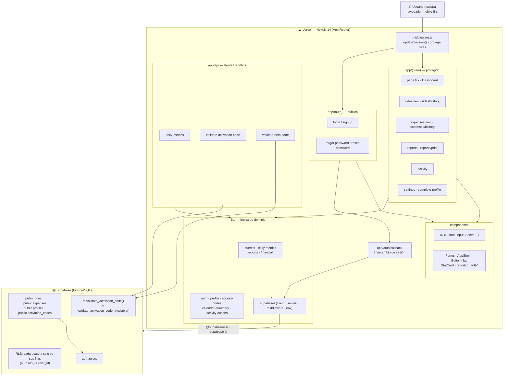
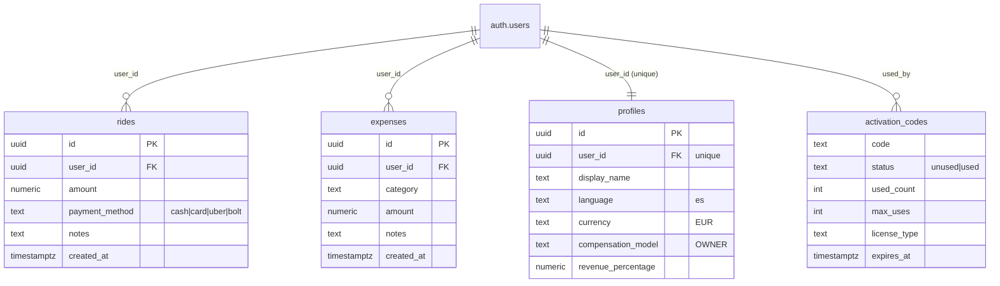

# Cabmetry — Arquitectura

App web **mobile-first** para taxistas: registra carreras (rides) y gastos (expenses),
y calcula el beneficio neto. Multiusuario con autenticación, perfiles, informes y
códigos de activación (licencias / beta).

## Stack tecnológico

| Capa | Tecnología |
|------|------------|
| Framework | **Next.js 14** (App Router, Server Components + Server Actions) |
| Lenguaje | **TypeScript 5** |
| UI / Estilos | **Tailwind CSS 3** (dark mode por `class`), **lucide-react** (iconos) |
| Backend / DB | **Supabase** — PostgreSQL + Auth + **Row Level Security (RLS)** + funciones `plpgsql` (`security definer`) |
| Auth | Supabase Auth (email + contraseña), sesión vía **middleware** (`@supabase/ssr`) |
| Utilidades | `date-fns` / `date-fns-tz` (fechas/zonas), `clsx`, `sonner` (toasts) |
| i18n | Español (`lib/i18n/es.ts`) |
| Tooling | ESLint (`eslint-config-next`), PostCSS, Autoprefixer, **repomix** (contexto IA) |
| Despliegue | **Vercel** |

## Diagrama de arquitectura

## Modelo de datos (PostgreSQL)

## Flujos clave

- **Autenticación**: `signup`/`login` (Supabase Auth) → `auth/callback` crea sesión →
  `middleware.ts` refresca y protege `app/(main)`. Cada usuario solo accede a sus datos vía **RLS**.
- **Registro rápido**: `rides/new` y `expenses/new` insertan filas con `user_id`; el
  **Dashboard** agrega ingresos − gastos = beneficio neto del día (`lib/queries`, `lib/daily-metrics`).
- **Informes**: `reports` calcula resúmenes operativos y financieros por rango, con exportación CSV e impresión.
- **Códigos de activación**: en el signup se valida el código con funciones `security definer`
  en Postgres (`validate_activation_code_available` no consume; `validate_activation_code` consume e incrementa uso).
